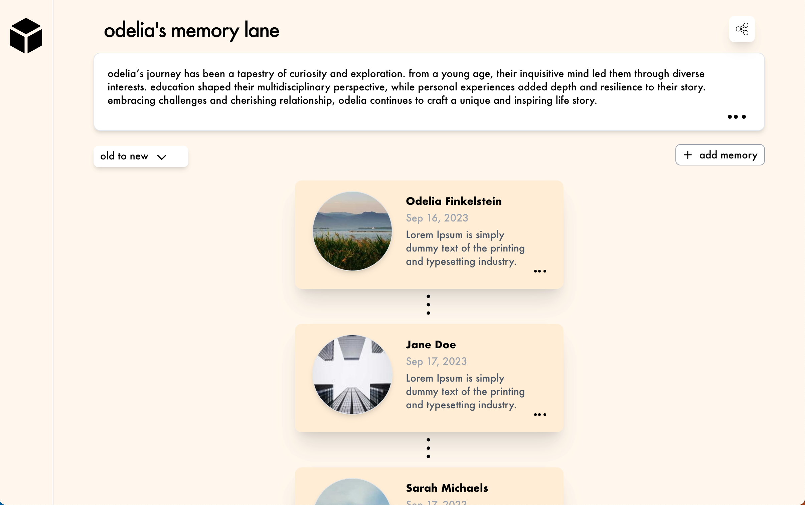

## Main idea:

The app is based off of X (formerly Twitter). Users are able to add, edit, delete posts. With the use of the API, posts are kept when the app is refreshed.

## Screenshot

## Getting Started

- to get the API started run `npm run serve:api`
- to run the local host run `npm run dev`

# Functionalities:

## Posting Memories

Users can create and post memories, which typically consist of text and optionally, images or other multimedia content.
Memories are timestamped upon creation and added to the user's memory feed.

## Editing Memories

Users can edit the content of their posted memories to correct mistakes or update information by clicking the three dots in the bottom right of the text area for a modal to pop up with the existing info to be changed.

## Deleting Memories

Users have the option to delete any memory they have posted.

## Chronological Display

Memories are displayed in order they were posted, with the most recent memory appearing appended to the bottom. This chronological order is maintained through the use of a chained column and can be adjusted by toggling the button.

## Stretch goals:

### Likes and Comments:

Allowing users to like and comment on memories, enhancing user engagement.

### Notifications:

Sending notifications to users when their memories receive likes or comments.

### User login:

Users can create an account by providing their email address, username, and password.

### Privacy Settings:

Giving users control over the visibility of their memories (public, private, friends-only).
